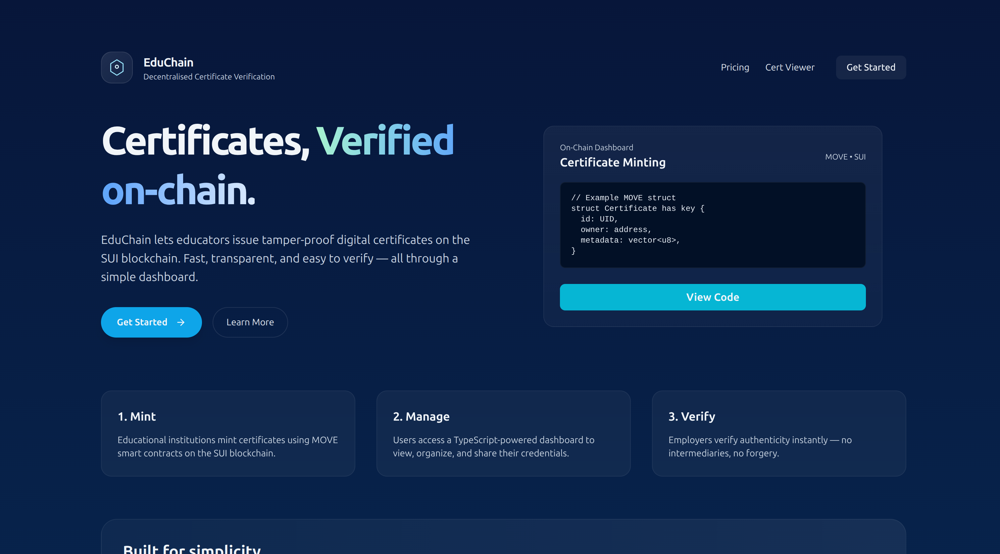

# EduChain: Decentralised Certificate Issuance and Verification



## Introduction

EduChain is a revolutionary platform that leverages the power of the SUI blockchain to provide a secure, transparent, and tamper-proof system for issuing and verifying digital certificates. In a world where digital credentials are becoming increasingly important, EduChain offers a decentralised solution that eliminates the need for traditional, centralized intermediaries, thereby reducing the risk of fraud and simplifying the verification process.

Our platform empowers educational institutions and organisations to issue certificates that are recorded on the SUI blockchain, making them immutable and easily verifiable by anyone, anywhere. Students and professionals can securely store and manage their credentials, with full control over their digital identity.

## Key Features

*   **Decentralised Identity:** With zkLogin, users can securely authenticate using their existing Google accounts, without compromising their privacy.
*   **On-Chain Certificates:** All certificates are minted as non-fungible tokens (NFTs) on the SUI blockchain, ensuring their authenticity and permanence.
*   **Tamper-Proof Verification:** Anyone can instantly verify the authenticity of a certificate by checking its transaction history on the SUI blockchain.
*   **User-Friendly Dashboard:** A modern and intuitive user interface for both issuers and students to manage their courses and certificates.
*   **Secure and Private:** Built with a strong focus on security and privacy, ensuring that user data is protected at all times.

## Tech Stack

EduChain is built with a modern, robust, and scalable tech stack:

*   **Frontend:**
    *   [Next.js](https://nextjs.org/) - A popular React framework for building server-side rendered and static web applications.
    *   [React](https://reactjs.org/) - A JavaScript library for building user interfaces.
    *   [TypeScript](https://www.typescriptlang.org/) - A typed superset of JavaScript that enhances code quality and developer productivity.
    *   [Tailwind CSS](https://tailwindcss.com/) - A utility-first CSS framework for rapid UI development.
    *   [Shadcn/ui](https://ui.shadcn.com/) - A collection of beautifully designed and accessible UI components.

*   **Backend:**
    *   [Next.js API Routes](https://nextjs.org/docs/api-routes/introduction) - For creating serverless API endpoints.
    *   [Drizzle ORM](https://orm.drizzle.team/) - A modern TypeScript ORM for building and querying databases.
    *   [Turso](https://turso.tech/) - A distributed database built on libSQL, perfect for scalable and low-latency applications.

*   **Blockchain:**
    *   [SUI](https://sui.io/) - A next-generation smart contract platform with high throughput and low latency.
    *   [Move](https://move-language.github.io/move/) - A safe and secure programming language for building smart contracts on the SUI blockchain.
    *   [zkLogin](https://docs.sui.io/concepts/cryptography/zklogin) - A decentralised authentication system that allows users to log in with their existing OAuth 2.0 credentials, such as Google.

*   **Other Key Libraries:**
    *   [Stripe](https://stripe.com/) - For processing payments and managing subscriptions.
    *   [Pinata](https://www.pinata.cloud/) - For storing and managing NFT metadata on IPFS.

## zkLogin: Secure and Private Authentication

zkLogin is a groundbreaking feature of the SUI blockchain that allows users to authenticate using their existing social media accounts, such as Google, without revealing any sensitive information. It uses zero-knowledge proofs (ZKPs) to verify the user's identity without requiring them to share their personal data with the application.

In EduChain, we use zkLogin to provide a seamless and secure onboarding experience for our users. Students and issuers can log in with their Google accounts, and a unique, non-custodial wallet is automatically generated for them on the SUI blockchain. This allows them to interact with the platform and manage their certificates without having to worry about the complexities of private keys and seed phrases.

## Smart Contracts

The core logic of EduChain is powered by a set of smart contracts written in the Move programming language. These contracts are deployed on the SUI blockchain and are responsible for managing the entire lifecycle of a digital certificate, from issuance to revocation.

Our main smart contract, `cert.move`, defines the structure of a certificate and includes the following key functions:

*   `new_cert`: Allows authorized issuers to mint new certificates and transfer them to the recipient's wallet.
*   `revoke_cert`: Enables issuers to revoke a certificate if it is no longer valid.

By using smart contracts, we ensure that all certificate-related transactions are transparent, immutable, and auditable.

## Getting Started

To get started with EduChain, you'll need to have the following installed on your local machine:

*   [Node.js](httpss://nodejs.org/) (v18 or later)
*   [pnpm](https://pnpm.io/)

Once you have the prerequisites installed, you can follow these steps to run the project locally:

1.  Clone the repository:
    ```bash
    git clone https://github.com/your-username/educhain.git
    ```
2.  Install the dependencies:
    ```bash
    pnpm install
    ```
3.  Set up your environment variables:
    ```bash
    cp .env.example .env
    ```
    Be sure to fill in the required environment variables in the `.env` file, such as your SUI RPC endpoint, Google client ID, and other API keys.

4.  Run the development server:
    ```bash
    pnpm dev
    ```

The application should now be running on [http://localhost:3000](http://localhost:3000).

## Project Structure

The EduChain project is organised into the following directories:

*   `app`: Contains the main application code, including the Next.js pages, API routes, and UI components.
*   `components`: Contains the reusable UI components used throughout the application.
*   `contracts`: Contains the Move smart contracts for the SUI blockchain.
*   `db`: Contains the database schema and Drizzle ORM configuration.
*   `lib`: Contains the core business logic and utility functions.
*   `public`: Contains the static assets, such as images and fonts.
*   `ui`: Contains the UI components that are specific to a particular page or feature.

